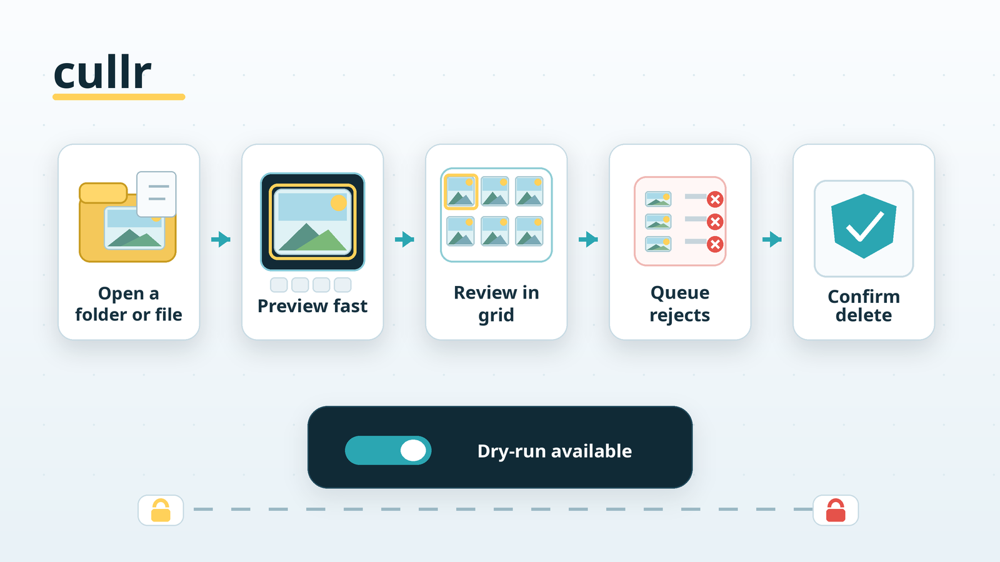

# cullr

`cullr` is a fast desktop media viewer and culling tool for reviewing a folder
of images and videos, marking rejects, and deleting the queued files only after
an explicit confirmation step.



## What It Does

- Opens a media directory in grid view, opens a specific file in preview view
  positioned inside its parent directory, or opens multiple explicit files as a
  focused review set.
- Shows a large preview view and a thumbnail grid view for fast review.
- Decodes images on worker threads and uploads them as GPU textures, so the
  window can resize without re-decoding every frame.
- Uses libjpeg-turbo scaled decode for large JPEG previews, with other formats
  decoded through the Rust `image` crate.
- Uses linked FFmpeg libraries for video thumbnails and playback.
- Keeps preview and thumbnail data in memory; it does not write image cache
  files into the input directory.
- Lets you queue media for deletion, inspect the queue, and confirm before
  files are removed.

## Quick Start

Run from source with Cargo:

```sh
cargo run -- /path/to/media
```

Scan subfolders too:

```sh
cargo run -- --recursive /path/to/media
```

Try the delete flow without removing files:

```sh
cargo run -- --dry-run-delete /path/to/media
```

Build a release binary:

```sh
cargo build --release
./target/release/cullr /path/to/media
```

## CLI Options

```text
Usage: cullr [OPTIONS] [PATH]...
```

| Option | Description |
| --- | --- |
| `PATH` | Media file(s) or directory to open. One file opens its folder positioned on that file; multiple files open only that explicit set. |
| `-d, --directory <DIR>` | Directory to open. |
| `--recursive` | Include media in subdirectories. |
| `--file_ext <EXTS>` | Comma-separated extensions to include, for example `jpg,png,webp`. |
| `--media <MEDIA>` | Media type to include: `both`, `image`, or `video`. Defaults to `both`. |
| `--sort <SORT>` | Initial sort: `newest`, `oldest`, `name`, or `name-desc`. |
| `--locale <LOCALE>` | Locale to use for name sorting, for example `sv` or `en`. |
| `--dry-run-delete` | Exercise the delete flow without deleting files. |
| `--hidden` | Include hidden files and directories. |
| `--auto-next` | Automatically advance to the next video when playback ends. |

If no path or directory is supplied, `cullr` opens the current working
directory. If multiple paths are supplied, they must all be files.

## Keyboard Shortcuts

| Key | Action |
| --- | --- |
| `h` / `k` / left / up | Previous file in preview mode. |
| `l` / `j` / right / down | Next file in preview mode. |
| `g` | Toggle between preview and grid. |
| `enter` | Open the highlighted grid file in preview mode. |
| `h` / `l` | Move left or right in grid mode. |
| `j` / `k` | Move down or up one row in grid mode. |
| `ctrl+d` / `ctrl+u` | Move half a page down or up in grid mode. |
| `home` / `end` | Jump to the first or last file. |
| `space` | Play or pause the current video. |
| `u` / `o` | Rewind or fast-forward the active video by 10%. |
| `y` | Briefly show the active video progress overlay. |
| `d` | Toggle the current file in the delete queue. |
| `u` | Remove the current file from the delete queue when no video is active. |
| `shift+D` | Show the delete queue grid. |
| `ctrl+R` | Confirm deletion for queued files. |
| `y` / `n` | Accept or cancel the delete confirmation. |
| `z` | Toggle fit-to-window and original-pixels zoom. |
| `f` | Toggle fullscreen window mode. |
| `m` | Mute or unmute video audio. Videos start muted. |
| `a` | Toggle automatically advancing to the next video when playback ends. |
| `b` | Show or hide gallery media-type badges. |
| `t` | Cycle time sorting. |
| `n` | Cycle name sorting. |
| `r` | Toggle recursive scanning and rescan. |
| `shift+R` | Rescan the current directory. |
| `i` | Toggle the info overlay. |
| `?` | Toggle help. |
| `q` / `esc` | Quit, close overlays, or leave grid mode depending on context. |

## Supported Formats

By default, `cullr` scans for images and common video formats.

Images:

```text
jpg, jpeg, png, webp, gif, bmp, tiff, tif, avif, qoi, ico
```

Videos:

```text
mp4, m4v, mov, mkv, webm, avi, mpg, mpeg, m2v, ts, m2ts, mts, wmv, flv, 3gp, 3g2, ogv
```

Use `--media image` or `--media video` to restrict the scan by media type. Use
`--file_ext` to choose a different comma-separated extension set; the selected
`--media` mode still filters that explicit list.

Video support requires FFmpeg shared libraries available to the system linker.

## Delete Safety

Deletion is intentionally staged:

- Mark files with `d`.
- Review the queue with `shift+D`.
- Press `ctrl+R`, then confirm with `y`.

Before deleting, `cullr` checks that each queued path still belongs to the
selected directory or explicit selected-file set, is a real file rather than a
symlink, and has not changed size or modification time since it was scanned.
`--dry-run-delete` keeps the same flow but leaves all files on disk.

## Development

Run the test suite:

```sh
cargo test
```

The tests cover scanning, sorting, decode sizing, video first-frame decode,
delete safety, and the dry-run delete path.

## License

MIT
