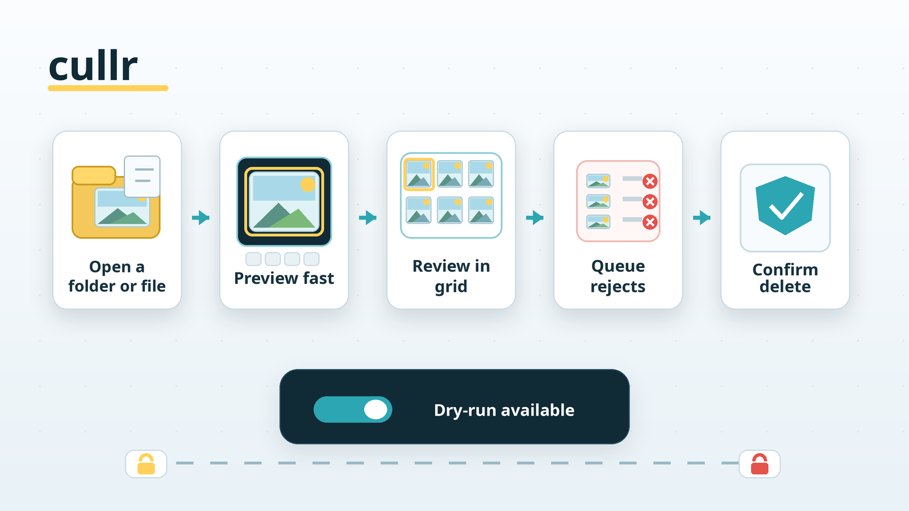

# cullr

`cullr` is a fast desktop media viewer and culling tool for reviewing a folder
of images and videos, marking rejects, and deleting the queued files only after
an explicit confirmation step.



## What It Does

- Opens a media directory in grid view, opens a specific file in preview view
  positioned inside its parent directory, or opens multiple explicit files as a
  focused review set.
- Shows a large preview view and a thumbnail grid view for fast review.
- Adds a file browser view with a folder/file list beside the preview or
  gallery pane.
- Decodes images on worker threads and uploads them as GPU textures, so the
  window can resize without re-decoding every frame.
- Uses libjpeg-turbo scaled decode for large JPEG previews, with other formats
  decoded through the Rust `image` crate.
- Uses linked FFmpeg libraries for video thumbnails and playback.
- Keeps preview and thumbnail data in memory; it does not write image cache
  files into the input directory.
- Lets you queue media for deletion, inspect the queue, and confirm before
  files are removed.

## Quick Start

Run from source with Cargo:

```sh
cargo run -- /path/to/media
```

Scan subfolders too:

```sh
cargo run -- --recursive /path/to/media
```

Try the delete flow without removing files:

```sh
cargo run -- --dry-run-delete /path/to/media
```

Build a release binary:

```sh
cargo build --release
./target/release/cullr /path/to/media
```

## CLI Options

```text
Usage: cullr [OPTIONS] [PATH]...
```

| Option | Description |
| --- | --- |
| `PATH` | Media file(s) or directory to open. One file opens its folder positioned on that file; multiple files open only that explicit set. |
| `-d, --directory <DIR>` | Directory to open. |
| `--recursive` | Include media in subdirectories. |
| `--file_ext <EXTS>` | Comma-separated extensions to include, for example `jpg,png,webp`. |
| `--media <MEDIA>` | Media type to include: `both`, `image`, or `video`. Defaults to `both`. |
| `--sort <SORT>` | Initial sort: `newest`, `oldest`, `name`, or `name-desc`. |
| `--view <VIEW>` | Initial view: `auto` or `browser`. Defaults to `auto`. |
| `--locale <LOCALE>` | Locale to use for name sorting, for example `sv` or `en`. |
| `--dry-run-delete` | Exercise the delete flow without deleting files. |
| `--hidden` | Include hidden files and directories. |
| `--auto-next` | Automatically advance to the next video when playback ends. |

If no path or directory is supplied, `cullr` opens the current working
directory. If multiple paths are supplied, they must all be files.
Direct file symlinks are rejected before path canonicalization. A requested
single file that is unsupported or excluded by the active media/extension
filters returns an error instead of opening a different file from its folder.
With `--view browser`, a folder launch opens the browser on the parent folder
with the launched folder highlighted; a file launch highlights that file.
Multiple explicit files still open as the focused grid review set.

## Keyboard Shortcuts

| Key | Action |
| --- | --- |
| `h` / `k` / left / up | Previous file in preview mode. |
| `l` / `j` / right / down | Next file in preview mode. |
| `g` | Toggle between preview and grid. |
| `e` | Toggle the file browser view. |
| `enter` | Open the highlighted grid file in preview mode. |
| `h` / `l` | Move left or right in grid mode. |
| `j` / `k` | Move down or up one row in grid mode. |
| `ctrl+d` / `ctrl+u` | Move half a page down or up in grid mode. |
| `ctrl+h` / `ctrl+l` | Move focus between browser and preview/gallery panes. |
| `j` / `k` | Move down or up in the browser pane. |
| `ctrl+d` / `ctrl+u` | Move half a page down or up in the browser pane. |
| `l` / `h` | Enter the selected browser folder or go to its parent. |
| `enter` | Open the selected browser folder, or focus the preview for a file. |
| `t` / `n` | Cycle time or name sorting in the browser pane. |
| `.` | Show or hide hidden files and folders. |
| `home` / `end` | Jump to the first or last file. |
| `space` | Play or pause the current video. |
| `u` / `o` | Rewind or fast-forward the active video by 10%. |
| `y` | Briefly show the active video progress overlay. |
| `d` | Toggle the current file in the delete queue, then select the next media file. |
| `u` | Remove the current file from the delete queue when no video is active. |
| `shift+D` | Show the delete queue grid. |
| `ctrl+R` | Confirm deletion for queued files. |
| `y` / `n` | Accept or cancel the delete confirmation. |
| `z` | Toggle fit-to-window and actual-size / 1:1 zoom. |
| `f` | Toggle fullscreen window mode. |
| `m` | Mute or unmute video audio. Videos start muted. |
| `a` | Toggle automatically advancing to the next video when playback ends. |
| `p` | Toggle sticky repeat mode for the current and subsequently selected videos. |
| `b` | Show or hide gallery media-type badges. |
| `t` | Cycle time sorting in the focused pane. |
| `n` | Cycle name sorting in the focused pane. |
| `r` | Toggle recursive scanning and rescan. |
| `shift+R` | Rescan the current directory. |
| `i` | Toggle the info overlay. |
| `?` | Toggle help. |
| `q` / `esc` | Quit, close overlays, or leave grid mode depending on context. |

## Supported Formats

By default, `cullr` scans for images and common video formats.

Images:

```text
jpg, jpeg, png, webp, gif, bmp, tiff, tif, avif, qoi, ico
```

Videos:

```text
mp4, m4v, mov, mkv, webm, avi, mpg, mpeg, m2v, ts, m2ts, mts, wmv, flv, 3gp, 3g2, ogv
```

Use `--media image` or `--media video` to restrict the scan by media type. Use
`--file_ext` to choose a different comma-separated extension set; the selected
`--media` mode still filters that explicit list. Plain `.ts` files are accepted
only when their first packets look like MPEG transport stream data, so TypeScript
source files are ignored.

Video support requires FFmpeg shared libraries available to the system linker.

## Live Media Updates

While the app is open, Cullr watches the active media directory and file-browser
directory for filesystem changes. Supported files that are added, removed, or
replaced in place appear automatically after they have finished writing. Native
Linux watches use the writer-close event; polling and other backends require the
file size and modification time to remain stable before refreshing.
Recursive mode watches the full directory tree. Explicit multi-file launches
continue to track only the files named on the command line, so unrelated files
created beside them are not added. Live directory scans, reconciliation, EXIF
time metadata, and sorting run on a background worker so large refreshes do not
block window input or rendering. Only the newest pending media and browser
results are retained during bursts of filesystem activity. Newly arrived files
are not full-size preview-prefetched until selected; visible grid thumbnails
remain available. A paused video keeps its displayed frame and discards late
queued frames instead of uploading them when a filesystem event wakes the UI.
Pausing also cancels pending full-size preview work while preserving textures
that are already resident. Filesystem refreshes are deferred entirely while a
video preview is paused, then coalesced into one current refresh after playback
resumes or the selection changes. Watcher and refresh-worker repaint requests
are also suppressed during the pause, so filesystem activity cannot force a GPU
present while another workload is writing a large file.

Cullr prefers native filesystem notifications and falls back to low-frequency
polling when the platform watcher is unavailable. Automatic updates preserve
unchanged previews and queued deletions; a queued file is unqueued if it changes
or disappears. Time sorting skips EXIF reads for source files larger than 64 MiB
and falls back to filesystem timestamps. `shift+R` remains a full manual rescan
and intentionally clears the entire delete queue and decoded-media cache.

## Delete Safety

Deletion is intentionally staged:

- Mark files with `d`.
- Review the queue with `shift+D`.
- Press `ctrl+R`, then confirm with `y`.

Before deleting, `cullr` checks that each queued path still belongs to the
selected directory or explicit selected-file set, is a real file rather than a
symlink, and has not changed size or modification time since it was scanned.
`--dry-run-delete` keeps the same flow but leaves all files on disk.
Every successful rescan clears the delete queue and refreshes decoded media, so
files must be reviewed and queued again after their on-disk state is refreshed.

## Development

Run the test suite:

```sh
cargo test
```

Run the complete local quality gate:

```sh
cargo fmt --all -- --check
cargo clippy --locked --all-targets --all-features -- -D warnings
cargo test --locked --all-targets
cargo build --release --locked
```

The tests cover scanning, sorting, decode sizing, video first-frame decode,
delete safety, and the dry-run delete path.

## License

MIT
